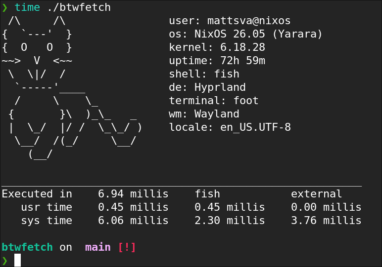

# btwfetch

A fast, modular system information tool written in C with a configuration-driven module pipeline.

---

## Overview

`btwfetch` is a lightweight system information utility designed around:

- minimal runtime overhead
- modular detection system
- config-driven module selection and ordering
- direct Linux interface usage (`/proc`, `/sys`, `getenv`, `uname`)

Only modules listed in the configuration file are executed.

---

## Picture



---

## Design Goals

- High performance (low syscall overhead)
- Zero unnecessary module execution
- Deterministic output ordering via config
- Simple, hackable C codebase
- No external runtime dependencies beyond glibc

---

### Key components

- Module system: function registry mapping string → detector function
- Config parser: reads ordered module list
- Common buffer system: single output buffer to reduce syscalls
- Detection modules: isolated system information collectors

---

## Configuration

Default config location:

<<<<<<< HEAD
project-root/config/default.conf

---

## Installation

### Install from release (recommended)

```bash
tar -xzf btwfetch-current-version.tar.gz
cd btwfetch-current-version
make
mkdir -p ~/.local/bin
cp btwfetch ~/.local/bin/
chmod +x ~/.local/bin/btwfetch
```

if you use fish:
```bash
set -U fish_user_paths $HOME/.local/bin $fish_user_paths
```
if not:
```bash
export PATH="$HOME/.local/bin:$PATH"
```

---
=======
config/default.conf
>>>>>>> e65aa731f6559989a9c19f3685ecbcc6a00723f3

### Example

user
os
kernel
uptime
shell
terminal
de
wm
theme
icons
resolution
cpu
cpu_usage
ram
memory_usage
gpu
packages
disk
battery
network
locale

---

## Build

### Requirements

- GCC or Clang
- Linux system headers (glibc assumed)

---

### Compile

```bash
make
```

---

### Run

```bash
./btwfetch
```

---

## Limitations

- Linux-only
- partial module implementation
- no caching yet
- no async execution yet
- no ascii art yet

---

## License

This project is licensed under the BSD 3-Clause License.

Copyright (c) 2026 mattsva

See the LICENSE file for full details.
